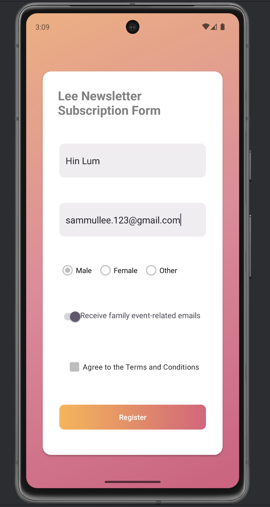
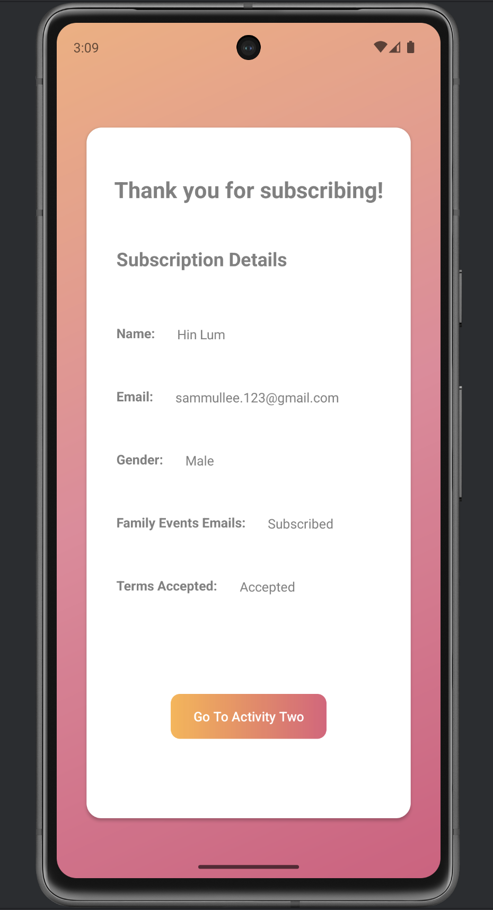
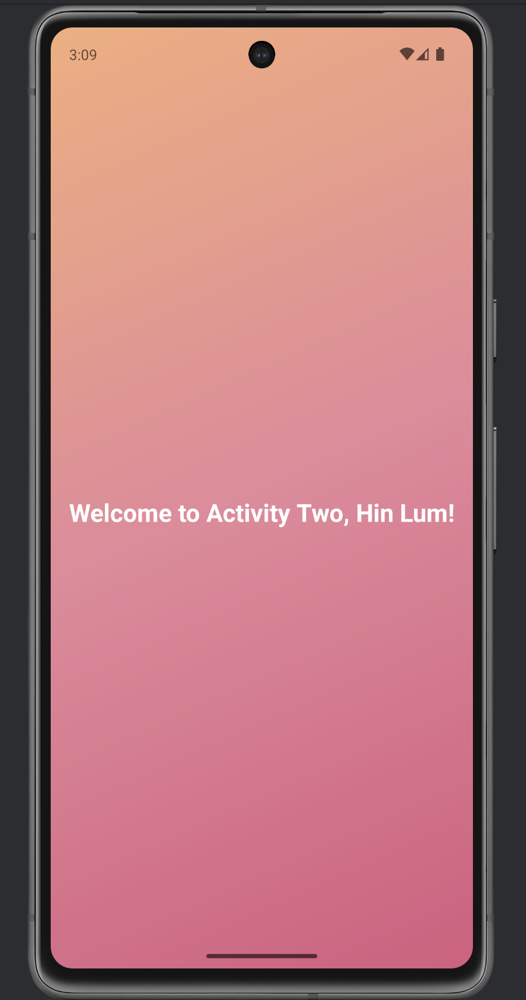

## Android Newsletter Subscription Demo

(*This Demo was completed during the last semester of a collegiate program.*)

Designed with Kotlin and Constraint Layout, an example Android application employing bundles shows fragment communication and activity navigation.

### Project Details

Using the following elements, this application runs a newsletter subscription flow:

- **MainActivity**: Hosts the fragments and manages navigation
- **NewsletterSubscriptionFormFragment**: Gathers user subscription data
- **ThankYouFragment**: Shows shown data and offers navigation to secondary activity
- **SecondActivity**: Displays personalized welcome message

### Key Features

- Bundles help in fragment-to- fragment communication
- Fragment-to-activity communication using Intents with extras
- Validation of forms and data collecting
- Custom UI components featuring gradient backgrounds
- ConstraintLayout implementation for responsive design

### Implementation Process

The application demonstrates:

1. Data collection in the subscription form fragment
2. Bundle creation and passing to the thank you fragment
3. Data display in the thank you fragment
4. Intent creation with extras for activity navigation
5. Data retrieval and display in the second activity

### Screenshots

  
   
  

### Video

[▶️ Watch the project demonstration video](https://youtu.be/ecCpasuokkg)

### Device Info 

**Language**: Kotlin

**Minimum SDK**: API 33 ("Tiramisu": Android 13.0)

**Display name**: Pixel 7 API 33 custom frag

### Assignment Context

This project was created as part of a mobile application development assignment to demonstrate understanding of:
- Fragment implementation and communication
- Activity navigation
- Bundle usage for data passing
- UI implementation with ConstraintLayout
